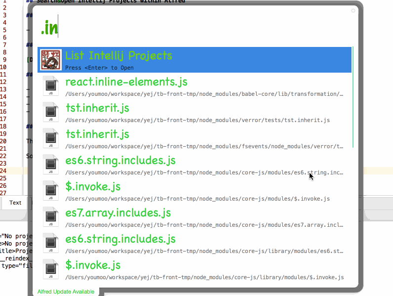

## Search&Open Intellij Projects within Alfred

### Requirements

- Latest node `brew install node`

### Download

[Download](Intellij Projects.alfredworkflow?raw=true)

### Usage

- Type `.intellij` to open **Intellij** projects
- Type `.wstorm` to open **WebStorm** projects
- Type `.pycharm` to open **PyCharm** projects
- Type `.reindex-intellij` to reindex projects
- Type `.reindex-intellij f` to force to reindex projects

### Note

This workflow would find all *.idea* dirs and cache them as Intellij projects.

So every time after you create new projects, don't forget re-run `.reindex-intellij`.

